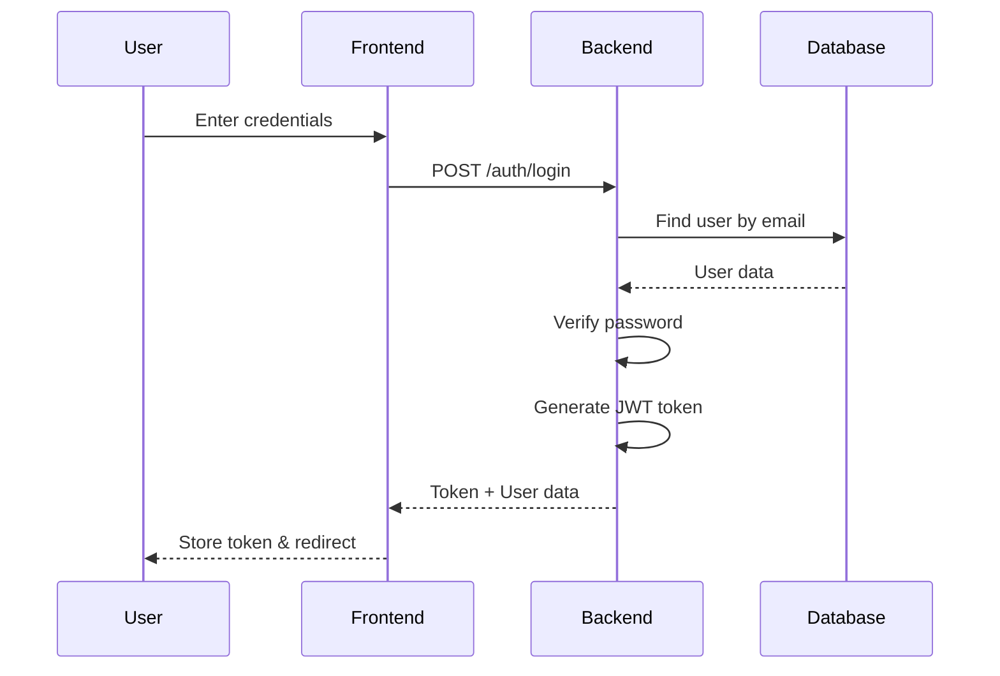
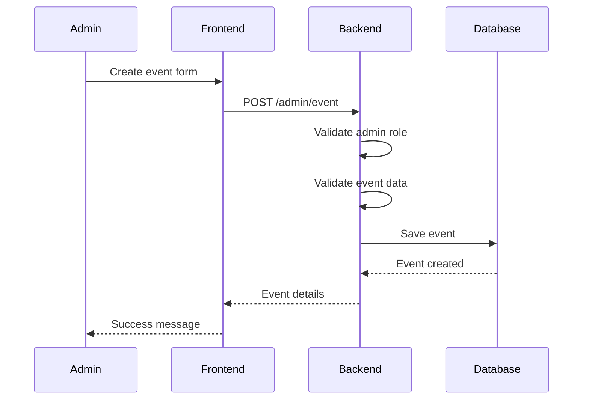
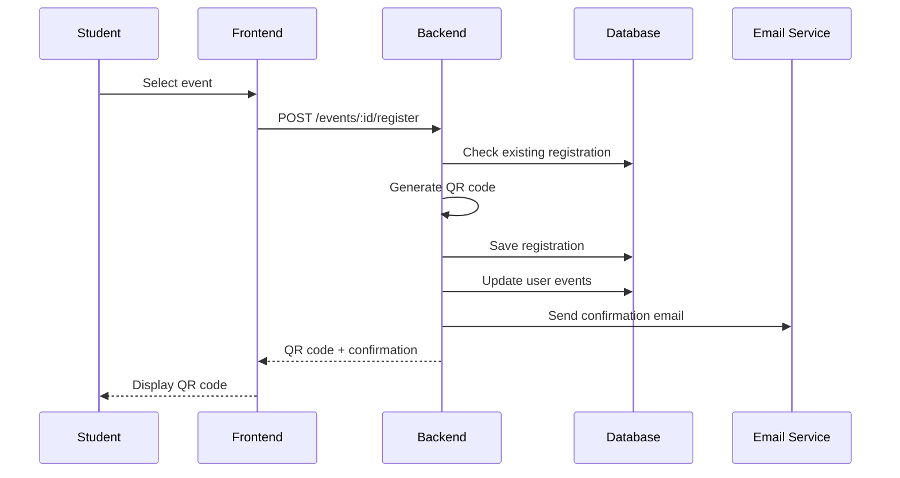
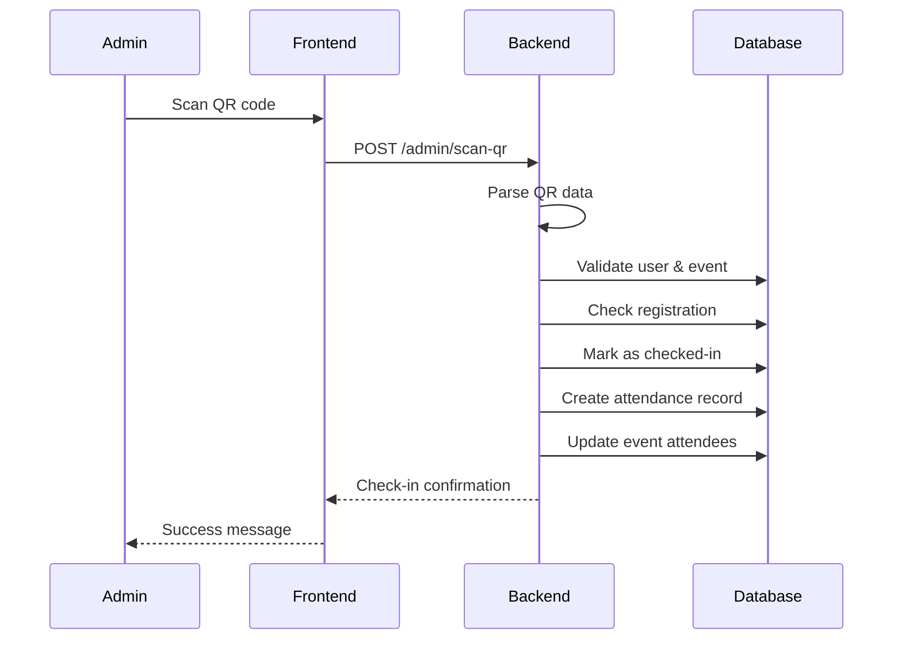
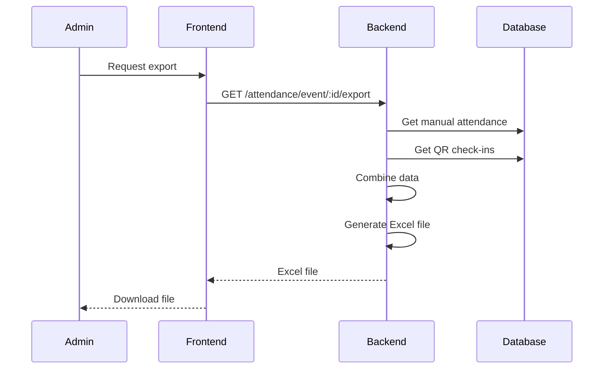

# ScanIN Backend Workflow Documentation

## 🏗️ System Architecture

```
┌─────────────────┐    ┌─────────────────┐    ┌─────────────────┐
│   Frontend      │    │   Backend       │    │   Database      │
│   (React/Vue)   │◄──►│   (Node.js)     │◄──►│   (MongoDB)     │
└─────────────────┘    └─────────────────┘    └─────────────────┘
                              │
                              ▼
                       ┌─────────────────┐
                       │   Email Service │
                       │   (Nodemailer)  │
                       └─────────────────┘
```

---

## 🔄 Complete Workflow Diagrams

### 1. **User Authentication Workflow**



### 2. **Event Creation Workflow (Admin)**



### 3. **Student Registration Workflow**



### 4. **QR Code Scanning Workflow (Admin)**



### 5. **Attendance Export Workflow**



---

## 📊 Data Flow Architecture

### **Registration Flow**
```
Student Input → Validation → Database Check → QR Generation → Email → Storage
```

### **Check-in Flow**
```
QR Scan → Validation → Attendance Marking → Database Update → Confirmation
```

### **Export Flow**
```
Request → Data Aggregation → Excel Generation → File Download
```

---

## 🔐 Security Workflow

### **Authentication Process**
```
1. User submits credentials
2. Backend validates input
3. Database lookup by email
4. Password comparison (bcrypt)
5. JWT token generation
6. Token returned to client
7. Client stores token
8. Token used for subsequent requests
```

### **Authorization Process**
```
1. Request with JWT token
2. Token verification
3. User lookup in database
4. Role validation
5. Route access granted/denied
```

### **Data Validation Process**
```
1. Input sanitization
2. Schema validation
3. Business logic validation
4. Database constraints
5. Error handling
```

---

## 🗄️ Database Workflow

### **User Management**
```
CREATE: Register → Validate → Hash Password → Save → Return Token
READ: Login → Find → Verify → Return Data
UPDATE: Profile → Validate → Update → Save
DELETE: Deactivate → Soft Delete → Archive
```

### **Event Management**
```
CREATE: Admin Input → Validate → Save → Return Event
READ: List Events → Filter → Paginate → Return
UPDATE: Admin Edit → Validate → Update → Save
DELETE: Admin Delete → Check Dependencies → Remove
```

### **Registration Management**
```
CREATE: Student Register → Generate QR → Save → Email
READ: List Registrations → Filter → Return
UPDATE: Check-in → Mark Attendance → Update
DELETE: Cancel Registration → Remove → Update Counts
```

### **Attendance Management**
```
CREATE: QR Scan/Manual → Validate → Record → Update
READ: Export Data → Aggregate → Format → Return
UPDATE: Modify Attendance → Validate → Update
DELETE: Remove Record → Update Counts
```

---

## 📧 Email Workflow

### **Registration Confirmation**
```
1. Student registers for event
2. Backend generates QR code
3. Email template prepared
4. Email sent via Nodemailer
5. Confirmation to student
```

### **Event Reminders**
```
1. Scheduled job runs
2. Check upcoming events
3. Find registered students
4. Send reminder emails
5. Track email status
```

---

## 🔄 Real-time Updates Workflow

### **Attendance Tracking**
```
1. QR code scanned
2. Database updated
3. Statistics recalculated
4. Real-time dashboard updated
5. Admin notified (optional)
```

### **Event Status Updates**
```
1. Event created/modified
2. Registered users notified
3. Dashboard refreshed
4. Statistics updated
```

---

## 📊 Analytics Workflow

### **Attendance Statistics**
```
1. Query registrations
2. Query attendance records
3. Calculate metrics:
   - Total registered
   - Total checked-in
   - Attendance rate
   - Check-in method breakdown
4. Return statistics
```

### **Event Analytics**
```
1. Query event data
2. Aggregate attendance
3. Calculate trends
4. Generate reports
5. Export data
```

---

## 🛠️ Error Handling Workflow

### **Validation Errors**
```
1. Input validation fails
2. Return 400 with details
3. Frontend displays errors
4. User corrects input
5. Retry request
```

### **Authentication Errors**
```
1. Invalid/missing token
2. Return 401
3. Redirect to login
4. Clear stored tokens
5. Re-authenticate
```

### **Authorization Errors**
```
1. Insufficient permissions
2. Return 403
3. Show access denied
4. Log attempt
5. Notify admin (optional)
```

### **Database Errors**
```
1. Connection issues
2. Query failures
3. Return 500
4. Log error details
5. Show user-friendly message
```

---

## 🔄 API Request/Response Flow

### **Standard Request Flow**
```
Client Request → CORS Check → Authentication → Authorization → Validation → Business Logic → Database → Response → Client
```

### **Error Response Flow**
```
Error Occurs → Error Handler → Log Error → Format Response → Return Error → Client Display
```

---

## 📈 Performance Optimization Workflow

### **Database Optimization**
```
1. Index creation
2. Query optimization
3. Connection pooling
4. Caching strategies
5. Performance monitoring
```

### **API Optimization**
```
1. Response compression
2. Request rate limiting
3. Caching headers
4. Pagination
5. Data filtering
```

---

## 🔄 Deployment Workflow

### **Development to Production**
```
1. Code development
2. Testing
3. Staging deployment
4. Production deployment
5. Monitoring
6. Maintenance
```

### **Database Migration**
```
1. Schema changes
2. Data migration
3. Index updates
4. Performance testing
5. Production deployment
```

---

## 📋 Monitoring Workflow

### **System Health**
```
1. Server status
2. Database connectivity
3. API response times
4. Error rates
5. User activity
```

### **Security Monitoring**
```
1. Failed login attempts
2. Unauthorized access
3. Suspicious activity
4. Token validation
5. Data integrity
```

This comprehensive workflow documentation provides a complete understanding of how the ScanIN backend system operates, from user interactions to data processing and system maintenance. 